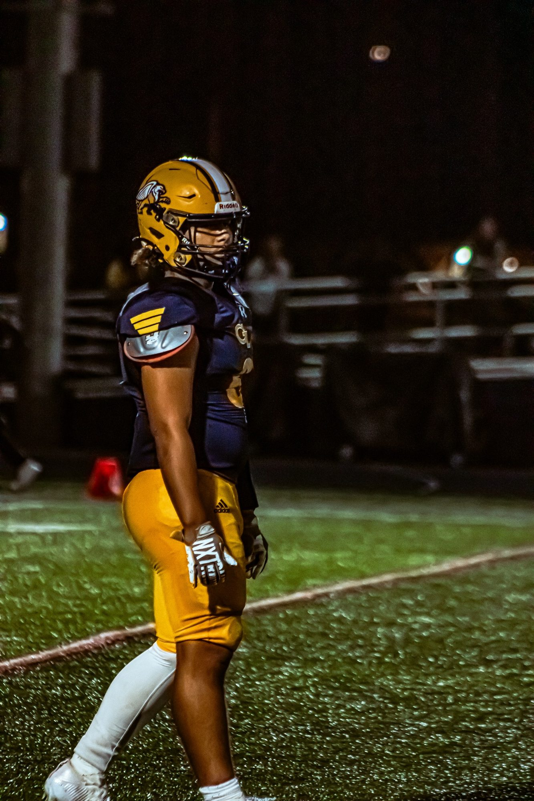

# Olivia Malomo Photography Portfolio

This repository hosts Olivia Malomo's sports photography portfolio site on **GitHub Pages**.

## 🌐 Live Site
Once GitHub Pages is enabled, the site will be live at:

```
https://<your-username>.github.io/OliviaPortfolio/
```

(or at a custom domain if configured).

---

## 📸 Updating Photos

1. Place new images in the repository (same folder as `index.html` or inside subfolders if you prefer).
   - Example: `IMG_3001.jpg`
2. Open `index.html` in a text editor.
3. Find the **Portfolio section**:
   ```html
   <div class="grid">
     <figure class="card"><figcaption>Friday Night Football</figcaption></figure>
   </div>
   ```
4. Add a new `<figure>` block for your image. Example:
   ```html
   <figure class="card"><figcaption>Varsity Dunk</figcaption></figure>
   ```
5. Save the file, commit, and push to GitHub.

The new photo will appear automatically on the live site.

---

## ✏️ Editing Text

- Update the **About** section in `index.html` if you want to change your bio or add achievements.
- Update the **Contact** section to change your email or add social links.

---

## ⚙️ Notes

- Keep image file names simple (no spaces).  
- Web-friendly images (around **1600px wide**) load fastest.  
- Captions (`<figcaption>`) are optional.  

---

© Olivia Malomo Photography
